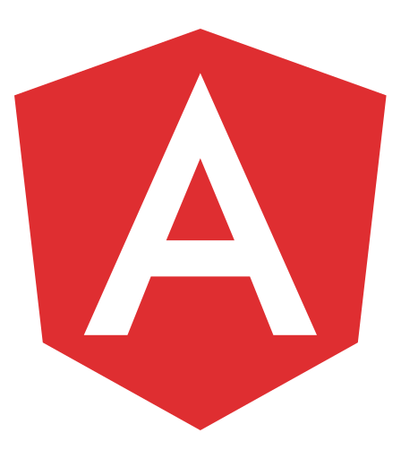
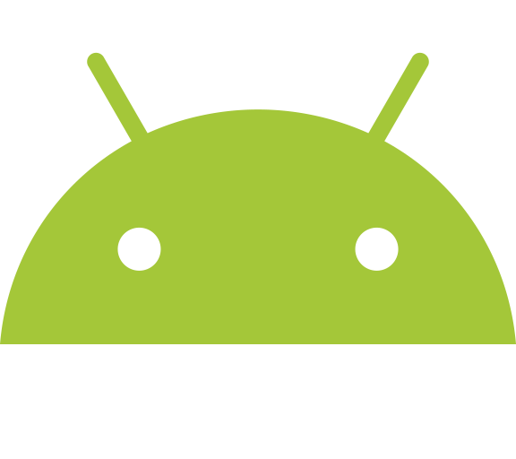

##  Hello there...

... and welcome to my GitHub page.

I'm Robert and I love playing and making video games. 🎮 Most certainly I currently am working on at least one game.

I've been coding since 2011 and working as an Angular developer since 2016. 

## Socials

[ LinkedIn](https://hu.linkedin.com/in/ingenmaffen)

[ Bitbucket](https://bitbucket.org/ingenmaffen/)

[ Github](https://github.com/ingenmaffen)

## Technologies I'm familiar with

### And some that I fairly know

### And some that I would love to learn

## Some stuff that I made 

[ Hexagonal Chess](http://hexagonal-chess.herokuapp.com/) 

[ 4am Hungarian Rummy](http://rummy-4am.herokuapp.com/) 

[ Mills 4am](https://mills-4am.web.app/) 

[ Hello, World!](https://github.com/ingenmaffen/hello-world)

[ OldSchool Labyrinth](https://gamejolt.com/games/oldschool-labyrinth/115943) 
